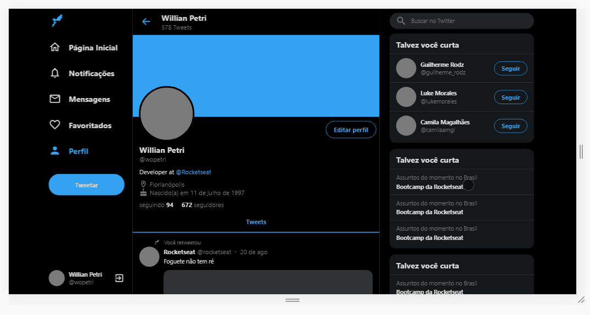

<h1 align="center">
  Twitter
</h1>

<div>
    
</div>

---

## 🚀 Technologies

This project was developed at the Rocketseat UI Clone youtube channel with the following technologies:

- [ReactJS](https://reactjs.org)
- [Typescript](https://www.typescriptlang.org/)
- [styled-components](https://styled-components.com/)
- [react-sticky-box](https://react-sticky-box.codecks.io/)
- [VS Code](https://code.visualstudio.com/) with [EditorConfig](https://marketplace.visualstudio.com/items?itemName=EditorConfig.EditorConfig)

---

## ⚙️ How To Use

```bash

  # Clone this repository
  $ git clone https://github.com/willianPetri/clone-twitter.git

  # Go into the repository
  $ cd clone-twitter

  # Install dependecies
  $ yarn install

  #Run the project
  $ yarn start
```

---

Made with ❤ by Willian Petri  [✌ Get in touch!](https://www.linkedin.com/in/willian-petri-84a935135/)
